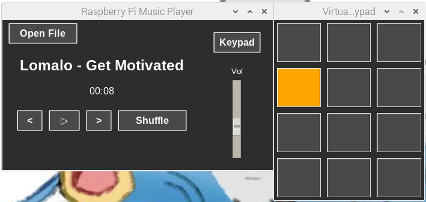
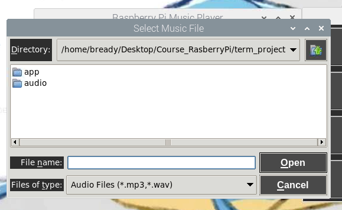
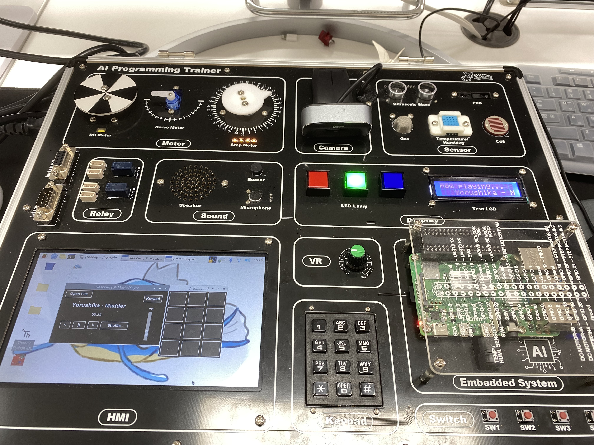

# Raspberry Pi Hardware Music Player & Drum Pad 🎵

라즈베리파이(Raspberry Pi) 기반의 하드웨어 통합형 **뮤직 플레이어 및 인터랙티브 드럼 패드** 애플리케이션입니다.   
파이썬(Python)과 `pygame`, `tkinter`를 활용하여 모니터 상의 소프트웨어 GUI와 물리적 하드웨어 센서/액추에이터를 실시간으로 완벽하게 연동하도록 설계되었습니다.

## 🌟 주요 특징

- **하드웨어 제어 기반 음악 재생**: 실물 스위치, 볼륨 노브(VR) 등을 이용해 음악을 직관적으로 제어할 수 있습니다.
- **다중 채널 드럼 패드 지원**: 3x4 매트릭스 키패드를 활용하여 배경 음악이 나오는 중에도 12가지 패드 사운드를 딜레이 없이 오버랩하여 동시 연주할 수 있습니다.
- **실시간 GUI 동기화**: 물리적 버튼을 누르면 모니터의 GUI 화면에도 시각적 피드백(버튼 눌림, 색상 변화 등)이 반영되는 최적화된 스레딩(Threading) 구조를 갖추고 있습니다.
- **하드웨어 동작 시각화**: 음악이 재생되면 스텝 모터가 회전하고, LED 램프가 깜빡이며, LCD에 텍스트가 흘러가는 등 시각적, 물리적 즐거움을 제공합니다.
- **사용자 맞춤 음원 재생**: GUI의 `[Open File]` 버튼을 눌러 원하는 로컬 음원 파일(MP3, WAV 등)을 직접 선택하여 자유롭게 재생할 수 있습니다.

---

## 💻 기술 스택

- **Hardware**:
  - Raspberry Pi
  - I2C 16x2 LCD
  - 스텝 모터
  - RGB LED
  - 3x4 매트릭스 키패드
  - 푸시 스위치
  - 가변저항(VR)
- **Language**: Python 3
- **GUI Framework**: `tkinter`
- **Audio/Media**: `pygame` (`pygame.mixer` 다중 채널)
- **Hardware Control**: `RPi.GPIO` (GPIO 제어), `smbus` (I2C 제어)

---

## 📸 작동 결과

| 설명 | 이미지 |
| :--- | :--- |
| **1. 실행화면** |  |
| **2. 음원 불러오기 화면** |  |
| **3. 하드웨어 동작 사진** |  |

---

## 🛠 하드웨어 구성 및 작동 방식

각 하드웨어 모듈은 `app/hw/` 폴더 내에 개별 파일로 모듈화(Singleton 패턴)되어 있으며, 백그라운드 스레드를 통해 메인 GUI를 차단(Blocking)하지 않고 안전하게 동작합니다.

### 1. 입력 장치
- **4구 푸시 스위치 (`hw/switch.py`)**: 
  - **SW1**: 재생 및 일시정지 (Play / Pause)
  - **SW2**: 이전 곡 재생 (음악이 5초 이상 재생되었을 경우 현재 곡 처음으로 되감기)
  - **SW3**: 다음 곡 재생
  - **SW4**: 플레이리스트 셔플 (무작위 재생)
- **가변 저항 / VR 노브 (`hw/vr.py`)**: 
  - 아날로그 값을 읽어와 플레이어의 메인 볼륨을 0~100%까지 미세 조절합니다.
  - GUI의 볼륨 슬라이더와 실시간으로 연동됩니다.
- **3x4 매트릭스 키패드 (`hw/keypad.py`)**: 
  - 총 12개의 버튼으로 이루어진 물리 키패드입니다. 
  - 누르는 즉시 `audio/pad1.wav` ~ `pad12.wav`의 음원을 각각의 독립된 채널로 겹쳐서 재생(Mixing)하는 드럼 머신(Launchpad) 역할을 합니다.

### 2. 출력 장치
- **16x2 I2C LCD 디스플레이 (`hw/lcd.py`)**: 
  - 첫 번째 줄: `now playing...` 표시
  - 두 번째 줄: 현재 재생 중인 곡의 제목이 우측에서 좌측으로 부드럽게 스크롤(흐름)됩니다. 음악 정지 시 스크롤도 멈춥니다.
- **스텝 모터 (`hw/motor.py`)**: 
  - 음악이 재생되는 동안에만 레코드판이 돌아가듯 모터가 회전합니다. (정지 시 모터도 회전 정지)
- **3색 RGB LED (`hw/led.py`)**: 
  - 음악이 재생 중일 때 빨강(Red) → 초록(Green) → 파랑(Blue) 순서로 화려하게 깜빡이며 분위기를 연출합니다.

### 3. 오디오 장치 (`player.py`)
- **Pygame Mixer (ALSA)**: 라즈베리파이의 오디오 드라이버와 통신하여 사운드를 스피커로 출력합니다. 배경 음악 스트리밍 채널 1개와 패드 사운드 동시 재생을 위한 다중 가상 채널 8~12개를 동시에 구동합니다.

---

## 💻 소프트웨어 GUI

마우스와 키보드로도 모든 기능을 제어할 수 있는 직관적이고 모던한 다크 테마 GUI를 제공합니다.

- **Main Window (`app/gui.py`)**: 곡의 진행 시간, 셔플, 재생/정지 버튼과 가변저항을 시각화한 세로형 볼륨 슬라이더, 그리고 PC에 있는 MP3/WAV 파일을 직접 불러올 수 있는 `[Open File]` 기능을 지원합니다.
- **Virtual Keypad Window (`app/gui_keypad.py`)**: 우측 상단의 `[Keypad]` 버튼을 누르면 팝업되는 가상 런치패드 창입니다. 12개의 패드를 마우스로 클릭하면 해당 음원이 재생되며, 물리 하드웨어 키패드를 누를 때도 화면의 패드 색상이 무지개빛으로 반짝이며 연동됩니다.

---

## ⚙️ 실행 및 종료 방법

1. **프로그램 실행**:
   터미널에서 프로젝트 최상위 경로로 이동한 뒤 아래 명령어를 실행합니다.
   ```bash
   python main.py
   ```
2. **프로그램 종료**:
   - GUI 창 우측 상단의 `X` 버튼을 눌러 종료합니다.
   - 내부의 `cleanup_app()` 메커니즘을 통해 동작 중이던 모터, LED, 스레드, 스피커 메모리 할당 및 GPIO 핀 배선 상태가 다른 프로세스에 영향을 주지 않도록 완벽하고 깨끗하게 자동 초기화(해제) 됩니다.

---

> **참고 (핀 충돌 주의)**: `hw/switch.py`와 `hw/keypad.py` 모듈이 만약 동일한 GPIO 핀을 공유하도록 배선되어 있다면, 하드웨어 쇼트나 입력 오류가 발생할 수 있습니다. 핀 맵(Pin Map)이 서로 겹치지 않도록 실제 라즈베리파이 배선을 꼼꼼히 확인 후 실행하시기 바랍니다.
